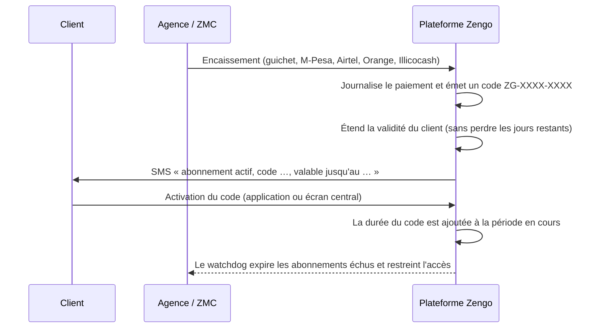

# Abonnements & encaissements

Itération 4 du cahier des charges : codes d'abonnement uniques liés au client,
transmis par SMS à chaque paiement, durée de 30, 90 ou 180 jours, caisse et
relevé des encaissements, expiration automatique et restriction d'accès.

---

## 1. Parcours commercial



Points clés :

- **un paiement = un code** : la ligne `payments` et la ligne `subscriptions`
  sont créées dans la même transaction ; le client ne peut pas payer sans
  recevoir de code ;
- **renouvellement sans perte** : si le client renouvelle avant l'échéance, la
  nouvelle période démarre à la fin de la précédente ;
- **le code est la preuve d'achat** : il reste consultable dans l'historique du
  dossier, même après activation ;
- **tout est relisible** : montant, devise, taux appliqué, moyen de paiement,
  référence opérateur et agent encaisseur.

## 2. Tarification

Le prix est calculé à partir du groupe tarifaire du client :

| Durée | Remise | Exemple à 20 $/mois |
|---|---|---|
| 30 jours | — | 20,00 $ |
| 90 jours | 5 % | 57,00 $ |
| 180 jours | 10 % | 108,00 $ |

- les **frais d'installation** (`registrationFeeUsd`) ne sont facturés qu'au
  **premier** abonnement du client ;
- un encaissement peut être réglé en **USD ou en CDF** : le taux du groupe
  tarifaire (ou celui du jour) est appliqué et conservé sur la ligne de
  paiement ;
- un agent peut saisir un **montant négocié**, différent du prix catalogue : le
  montant encaissé est alors celui qui est journalisé, et la remise accordée
  apparaît sur le code.

## 3. Codes

Format `ZG-XXXX-XXXX`, alphabet sans caractères ambigus (`0/O`, `1/I` exclus) :
un code dicté au téléphone ne se confond pas.

| État | Signification |
|---|---|
| `ISSUED` | émis, en attente d'activation |
| `ACTIVATED` | activé par le client ou au guichet |
| `EXPIRED` | jamais activé 30 jours après l'émission |
| `CANCELLED` | annulé par le service client (erreur, remboursement) |

La saisie est normalisée : `zgk4pm7rtq`, `ZG K4PM 7RTQ` et `ZG-K4PM-7RTQ`
désignent le même code.

Un code **déjà activé ne peut pas être annulé** : il faut alors suspendre
l'abonnement du client, ce qui laisse une trace comptable différente.

## 4. Expiration et restriction

Un watchdog tourne **toutes les 10 minutes** :

1. les clients dont `subscriptionExpiresAt` est dépassé passent en
   `subscriptionStatus = EXPIRED` et `status = EXPIRED` — la surveillance et les
   services associés sont restreints ;
2. les codes jamais activés depuis 30 jours passent en `EXPIRED` ;
3. tous les jours à 8 h, les clients à moins de 7 jours de l'échéance reçoivent
   un **SMS de relance** : un client prévenu ne se plaint pas d'une coupure, il
   se plaint d'avoir oublié de payer.

Un client qui paie retrouve immédiatement l'accès complet, même si l'expiration
automatique l'avait restreint entre-temps.

## 5. Webhooks Mobile Money

Les opérateurs poussent leurs accus sur une route unique :

```
POST /api/v1/subscriptions/payments/webhooks/:operator      (:operator = mpesa | airtel | orange | illicocash)
```

Chaque passerelle (`src/modules/subscriptions/providers/mobile-money.provider.ts`)
normalise la charge utile de son opérateur :

| Opérateur | Champs reconnus |
|---|---|
| M-Pesa (Vodacom) | `TransID`, `TransAmount`, `MSISDN`, `BillRefNumber` ; et la réponse d'une demande de paiement (`Body.stkCallback.*`) |
| Airtel Money | `transaction.id`, `transaction.amount`, `transaction.status.code`, `transaction.msisdn` |
| Orange Money | `txnid`, `amount`, `status`, `msisdn`, `order_id` |
| Illicocash | `transactionId`, `amount`, `currency`, `phoneNumber`, `status` |

Le résultat est une notification normalisée : opérateur, identifiant de
transaction, montant, devise, numéro payeur, référence, succès ou motif d'échec.

### Traitement, dans l'ordre

1. **paiement refusé** → la ligne est enregistrée en `FAILED` avec le motif : la
   caisse peut justifier le non-encaissement ;
2. **transaction déjà connue** → réponse `DUPLICATE`, aucune double activation
   (la référence opérateur est unique en base) ;
3. **client identifié** (par numéro principal/secondaire, puis par identifiant
   Zengo ou code d'abonnement cité en référence) → paiement confirmé,
   abonnement émis, validité étendue, **code envoyé par SMS** ;
4. **client non identifié** → paiement conservé en `PENDING` avec
   `needsReconciliation: true` : on n'invente jamais un porteur à partir d'un
   numéro inconnu.

La durée est déduite du montant reçu (la plus longue que le montant couvre,
minimum 30 jours) ; un rapprochement manuel permet de choisir la durée exacte.

### Sécurité

- route publique mais **throttlée** (240 requêtes/minute) ;
- si `MOBILE_MONEY_WEBHOOK_SECRET` est défini, l'en-tête `x-operator-signature`
  doit porter le HMAC-SHA256 attendu, sinon la notification est rejetée avant
  tout traitement ;
- un webhook non authentifié ne peut jamais activer un abonnement seul : au pire
  il crée une ligne à rapprocher.

## 6. Caisse virtuelle et rapprochement

| Méthode | Route | Rôle |
|---|---|---|
| `GET` | `/subscriptions/payments?status=&method=&days=` | journal des encaissements |
| `GET` | `/subscriptions/payments/reconciliation?days=` | rapprochement de caisse |
| `POST` | `/subscriptions/payments/:id/reconcile` | rattacher un paiement en attente à un client |

Le rapprochement renvoie :

- `byOperator` — par moyen de paiement : nombre de mouvements, montants USD et
  CDF ;
- `confirmed` — totaux des encaissements confirmés ;
- `pending` — paiements annoncés mais non rattachés, avec la liste détaillée ;
- `byDay` — évolution quotidienne.

Deux anomalies sont ainsi détectables sans outil externe : un paiement reçu dont
le porteur est inconnu, et un client qui déclare avoir payé sans que
l'encaissement apparaisse.

## 7. API

Authentification JWT. Le portefeuille global est réservé à l'encadrement et à
la caisse ; un client ne voit que ses propres codes.

| Méthode | Route | Rôles | Rôle |
|---|---|---|---|
| `POST` | `/subscriptions` | caisse, encadrement, ZMC | encaisser, émettre le code, étendre la validité, envoyer le SMS |
| `POST` | `/subscriptions/activate` | authentifié (client inclus) | activer un code |
| `GET` | `/subscriptions?clientId=&status=&expiringSoon=&page=&limit=` | caisse, encadrement, superviseurs | journal des codes |
| `GET` | `/subscriptions/clients/:clientId` | caisse, encadrement, propriétaire du dossier | état d'abonnement et historique |
| `GET` | `/subscriptions/:id` | caisse, encadrement, propriétaire | détail d'un code |
| `PATCH` | `/subscriptions/:id/cancel` | caisse, encadrement | annuler un code jamais activé |
| `GET` | `/subscriptions/stats?days=` | caisse, encadrement | indicateurs de caisse |
| `POST` | `/subscriptions/maintenance/expire-due` | direction technique | déclencher le passage du watchdog |

### Exemple — encaissement

```json
POST /subscriptions
{
  "clientId": "a5527c54-6912-4c35-989d-bd6687967dd1",
  "durationDays": 90,
  "method": "MPESA",
  "currency": "CDF",
  "operatorReference": "MP241003.1421.A88213"
}
```

```json
{
  "subscription": {
    "code": "ZG-K4PM-7RTQ",
    "durationDays": 90,
    "startsAt": "2026-10-03T19:41:21.569Z",
    "endsAt": "2027-01-01T19:41:21.569Z",
    "validity": "90 jour(s) restant(s)",
    "priceUsd": "57.00",
    "discountUsd": "3.00"
  },
  "payment": { "status": "CONFIRMED", "amountUsd": "57.00", "amountCdf": "159600.00" },
  "smsSent": true
}
```

### Indicateurs de caisse

`GET /subscriptions/stats?days=30` renvoie : chiffre encaissé en USD et en CDF,
nombre de paiements, abonnements émis, clients actifs, clients à échéance
proche, clients expirés, répartition par moyen de paiement et **paiements
annoncés mais non confirmés** (premier signal de fraude ou d'erreur de caisse).

## 8. Modèle de données

`Subscription` (`subscriptions`) — un code, une période.

| Champ | Rôle |
|---|---|
| `clientId`, `code` | porteur et code unique |
| `durationDays`, `status` | durée commerciale et état du code |
| `startsAt`, `endsAt` | période couverte |
| `priceUsd`, `priceCdf`, `exchangeRate`, `discountUsd` | prix et remise appliqués |
| `tariffGroupId`, `isFirstSubscription` | origine du prix, frais d'installation |
| `issuedById`, `issuedByLabel`, `issuedAt` | agent encaisseur |
| `activatedAt`, `activatedBy` | date et canal d'activation |
| `cancelledAt`, `cancellationReason` | annulation motivée |

`Payment` (`payments`) — un mouvement d'argent.

| Champ | Rôle |
|---|---|
| `clientId`, `subscriptionId` | rattachement |
| `method`, `channel` | M-Pesa, Airtel, Orange, Illicocash, espèces, virement |
| `amountUsd`, `amountCdf`, `exchangeRate` | montants et taux du jour |
| `payerMsisdn`, `operatorReference` | traçabilité opérateur (référence unique) |
| `status`, `paidAt`, `confirmedAt` | état de l'encaissement |
| `organizationId`, `recordedById`, `recordedByLabel` | caisse et agent |
| `failureReason`, `notes`, `metadata` | motif d'échec et commentaires |

La colonne `operatorReference` est **unique** : une même transaction Mobile Money
ne peut pas être encaissée deux fois.

## 9. Console

Écran **Abonnements** (groupe *Gestion*) :

- indicateurs : encaissé en USD et CDF, clients actifs, échéances proches ;
- journal des codes : code, client, période, montant, remise, statut, agent ;
- filtres : statut du code, échéance sous 7 jours ;
- **Encaisser un abonnement** : client, durée, moyen de paiement, devise,
  référence opérateur, note de caisse — avec rappel de l'état d'abonnement du
  client sélectionné avant validation ;
- **Activer un code** : saisie tolérante (minuscules, espaces, tirets).

## 10. Configuration

| Variable | Défaut | Rôle |
|---|---|---|
| `BILLING_EXCHANGE_RATE_USD_CDF` | `2800` | Taux appliqué si le groupe tarifaire n'en porte pas |
| `BILLING_DEFAULT_MONTHLY_FEE_USD` | `20` | Mensualité de repli |
| `BILLING_AUTO_EXPIRE` | `true` | Restriction automatique des abonnements échus |
| `BILLING_REMINDERS` | `true` | Relance SMS des clients à échéance proche |
| `MOBILE_MONEY_WEBHOOK_SECRET` | *(vide)* | Secret partagé des webhooks opérateurs (HMAC-SHA256) |

## 11. Tests

| Suite | Périmètre | Résultat |
|---|---|---|
| `subscription.util.spec.ts` | codes, prix et remises, validité, renouvellement, restriction | 19 tests |
| `mobile-money.provider.spec.ts` | normalisation des quatre opérateurs, numéros, échecs, charges inexploitables | 12 tests |
| `npm run smoke:subscriptions` | encaissement, code, SMS, activation, renouvellement, annulation, sécurité, caisse, webhooks, rapprochement, expiration | 51 contrôles |

```bash
npm run smoke:subscriptions
npm run smoke:all          # socle + alertes + interventions + abonnements
```

## 12. Suite de l'itération 4

Reste à livrer pour clore l'itération :

- [ ] envoi du code depuis l'application client avant encaissement (demande de
      paiement poussée vers le téléphone du client) ;
- [ ] tableau de bord finance dédié (par agence, par caissier, par mois) ;
- [ ] rapprochement automatique de bout en bout lorsque l'opérateur fournit un
      relevé périodique (fichier ou API de settlement).
