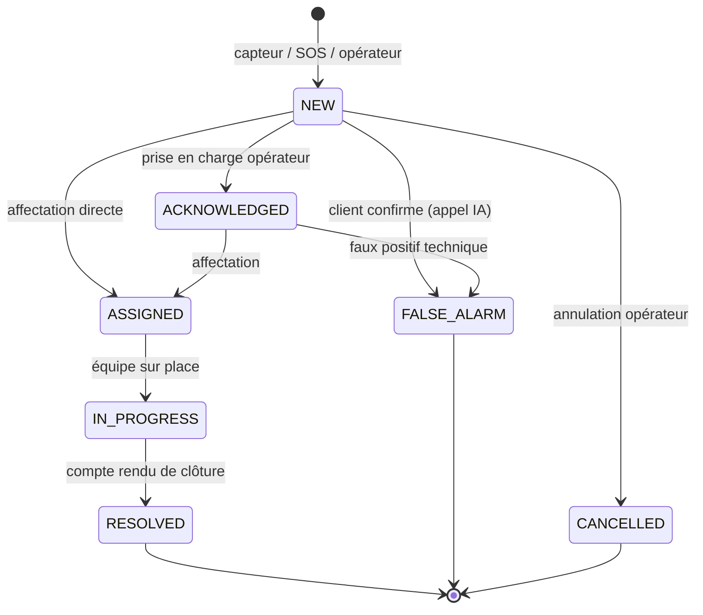
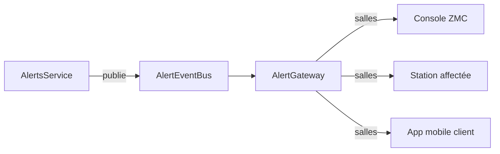

# Alertes & Zengo Monitoring Center (ZMC)

> Itération 2 — implémente la chaîne d'alerte complète du cahier des charges :
> réception, analyse, appel vocal IA multilingue, affectation aux stations,
> temporisation de 5 minutes et escalade automatique.

## 1. Cycle de vie d'une alerte



Chaque transition écrit :
1. une ligne dans `alerts` (état courant),
2. un événement dans `alert_events` (chronologie du dossier d'intervention),
3. un événement temps réel sur le bus `AlertEventBus` (console ZMC).

## 2. Sources de déclenchement

| Source | Chemin | Gravité |
|---|---|---|
| Capteur / centrale SafAlert | MQTT `device/alarm` → `AlertsService.ingestDeviceAlarm` | selon le type déduit |
| Bouton SOS physique | `device/alarm` (sous-appareil `CON`) | `PANIC` → CRITICAL |
| Application mobile | `POST /alerts/sos` (rôle `CLIENT`) | choisie par le client |
| Opérateur ZMC | `POST /alerts` (rôle `OPERATOR` et assimilés) | choisie par l'opérateur |

### Déduction du type d'alerte

Le code du sous-appareil (Subdevice Code Map) est la source de vérité :

| Sous-appareil | Type d'alerte |
|---|---|
| `WSD` (fumée) | `FIRE` |
| `GLS` (gaz) | `GAS_LEAK` |
| `WLS` (eau) | `WATER_LEAK` |
| `DC`, `PIR`, `WOS`, `WIS` | `INTRUSION` |
| `CON` (télécommande) | `PANIC` |

Le code numérique brut de la centrale n'est utilisé qu'en dernier recours
(`1 → SABOTAGE`, `2 → SYSTEM`, `3 → FIRE`, `4 → MEDICAL`) : **ce mapping reste à
confirmer avec le fournisseur du kit**, la documentation MQTT ne le précise pas.

### Regroupement des déclenchements répétitifs

Un même sous-appareil qui redéclenche dans la fenêtre
`ALERT_GROUPING_WINDOW_SECONDS` (120 s par défaut) **ne crée pas une nouvelle
alerte** : l'alerte existante voit son compteur `occurrenceCount` augmenter et sa
`lastOccurrenceAt` rafraîchie. Les alertes critiques (incendie, médical, panique,
gaz) ne sont jamais regroupées.

## 3. Appel vocal IA multilingue

Séquence du cahier des charges, jouée dans la langue préférée du client :

```
« Bonjour, ici le centre de surveillance Zengo. »
« Nous avons constaté une ouverture inhabituelle de porte chez vous
  pendant que votre système est armé. »
« Êtes-vous à l'origine de cette action ? »
« Appuyez sur 1 si ce n'est pas vous, sur 2 si c'est vous. »
```

| Réponse client | Effet |
|---|---|
| Touche `1` ou « non » | `INTRUSION_CONFIRMED` → gravité portée à CRITICAL et **escalade immédiate** vers toutes les stations du PDC |
| Touche `2` ou « oui » | `CONFIRMED_BY_CLIENT` → message de désarmement, alerte clôturée en `FALSE_ALARM` / `CLIENT_CONFIRMED` |
| Silence / réponse ambiguë | `NO_ANSWER` / `PARTIAL` → l'alerte reste ouverte, la temporisation de 5 minutes s'applique |

### Fournisseurs de téléphonie

| Fournisseur | Usage | Comportement |
|---|---|---|
| `STUB` (défaut) | Développement, tests, démonstration | Aucun appel réel : le script est journalisé et l'appel se pilote par les mêmes webhooks (`POST /voice-calls/webhooks/stub/input`) ou par `POST /voice-calls/:id/simulate/input` |
| `TWILIO` | Production | Appels réels (REST API + TwiML `<Gather input="dtmf speech">`), signature `X-Twilio-Signature` vérifiée sur chaque webhook |

Le fournisseur `STUB` est **interdit en production** (`TELEPHONY_PROVIDER=STUB`
avec `NODE_ENV=production` empêche le démarrage) : une alerte ne doit jamais
rester sans appel.

### Endpoints vocaux

| Route | Visibilité | Rôle |
|---|---|---|
| `GET /voice-calls/twiml/:id` | Publique (signée) | TwiML joué au décroché |
| `POST /voice-calls/twiml/:id/answer` | Publique (signée) | Action du `<Gather>` : enregistre la touche et renvoie le message de clôture |
| `POST /voice-calls/webhooks/:provider/status` | Publique (signée) | Statut d'appel (ringing, completed, no-answer…) |
| `POST /voice-calls/webhooks/:provider/input` | Publique (signée) | Saisie DTMF / reconnaissance vocale (fournisseurs à callback simple) |
| `POST /voice-calls/:id/simulate/input` | Rôles ZMC (dev) | Simulation d'une réponse client (fournisseur `STUB` uniquement) |

### Langues

Scripts disponibles en **français, anglais, swahili, lingala, chiluba et kikongo**.
En l'absence de langue renseignée, le système retombe sur le français (règle du
cahier des charges).

> ⚠️ Les versions swahili, lingala, chiluba et kikongo doivent être relues par un
> locuteur natif avant mise en production. Les moteurs TTS grand public ne
> couvrant pas ces langues, `toSpeechLanguage()` replie l'audio sur le français
> tant qu'un moteur dédié (Google/Azure/OpenAI) ou des enregistrements natifs ne
> sont pas branchés — l'interface d'extension est déjà en place.

## 4. Affectation et escalade

### Affectation (manuelle ou automatique)

`POST /alerts/:id/dispatch` sans `stationIds` déclenche l'affectation
automatique :

1. stations du point de distribution dont le type correspond à l'alerte
   (incendie → pompiers, médical → hôpital, intrusion → police) ;
2. à défaut, toutes les stations du PDC ;
3. à défaut, les stations de la zone régionale de rattachement.

Chaque station reçoit une ligne `alert_dispatches` (statut `NOTIFIED`) qu'elle
fait évoluer : `ACKNOWLEDGED`, `DECLINED`, `ARRIVED`, `COMPLETED`. Le passage à
`ARRIVED` fait basculer l'alerte en `IN_PROGRESS`.

### Temporisation de 5 minutes (watchdog)

> « Si aucune action dans les 5 minutes, le système déclenche automatiquement
> l'envoi à toutes les équipes actives du point de distribution. »

- Délai : `ALERT_ESCALATION_SECONDS` (défaut **300 s**).
- Fréquence de vérification : `ALERT_WATCHDOG_INTERVAL_SECONDS` (défaut 30 s).
- Une « action » = une affectation envoyée. Un simple accusé de réception
  opérateur **ne suffit pas** à annuler l'escalade.
- L'escalade diffuse à **toutes** les stations du PDC, marque
  `escalationLevel = 1` et trace un événement `ESCALATED`.
- L'escalade est idempotente : relancer l'opération ne crée pas de doublon.
- Escalade manuelle possible : `POST /alerts/:id/escalate` (option `regional`).

Le watchdog est également chargé de clore les appels vocaux restés sans réponse
au-delà de `VOICE_CALL_TIMEOUT_SECONDS`.

## 5. Diffusion temps réel



- Transport : **Socket.IO**, namespace `/realtime`.
- Authentification : JWT dans `handshake.auth.token` (jamais en paramètre
  d'URL, où il finirait dans les journaux). Un socket sans jeton valide est
  déconnecté immédiatement.
- Salles : une par organisation (`org:<id>`), plus la salle `national` pour les
  rôles à portée nationale. Une alerte est diffusée à l'agence porteuse, à ses
  ancêtres (zone, national) et aux stations affectées — donc **jamais** aux
  agences sœurs.
- Événements : `alert.created`, `alert.updated`, `alert.acknowledged`,
  `alert.dispatched`, `alert.escalated`, `alert.resolved`, `alert.cancelled`,
  `voice_call.updated`.

Exemple de connexion côté console :

```js
const socket = io('http://localhost:3000/realtime', { auth: { token: accessToken } });
socket.on('alert.created', (event) => addToQueue(event));
```

## 6. API de la console ZMC

| Route | Rôle |
|---|---|
| `GET /alerts` | File d'alertes du périmètre (statut, type, gravité, période, recherche) |
| `GET /alerts/stats` | Alertes ouvertes, répartition par statut/type, délai moyen de prise en charge et de clôture |
| `GET /alerts/:id` | Détail : client, dispositif, localisation, affectations, appels |
| `GET /alerts/:id/timeline` | Chronologie complète du dossier |
| `GET /alerts/:id/voice-calls` | Appels vocaux (statut, touche, intention, transcription, enregistrement) |
| `POST /alerts/:id/acknowledge` | Prise en charge |
| `POST /alerts/:id/dispatch` | Affectation (manuelle ou automatique) |
| `POST /alerts/:id/escalate` | Escalade manuelle |
| `POST /alerts/:id/resolve` | Clôture avec compte rendu |
| `POST /alerts/:id/false-alarm` | Classement en faux positif |
| `POST /alerts/:id/cancel` | Annulation |
| `POST /alerts/:id/notes` | Note au dossier |
| `PATCH /alerts/:id/dispatches/:dispatchId` | Statut d'une station |
| `GET /alerts/stations/:organizationId` | Stations d'une agence (interface de déploiement) |
| `POST /alerts` / `POST /alerts/sos` | Déclenchement opérateur / bouton d'urgence client |

## 7. Cloisonnement

| Acteur | Périmètre |
|---|---|
| Direction nationale, ZMC | Toutes les alertes |
| Superviseur / chef de zone | Alertes des agences de la zone |
| Chef d'agence | Alertes de son PDC uniquement |
| Agent de station | Alertes affectées à sa station (via les salles temps réel) |
| Client | Uniquement ses propres alertes (`GET /alerts`, `GET /alerts/:id`) |

Un contrôle direct hors périmètre renvoie `403`.

## 8. Tests

```bash
npm run smoke:alerts   # 46 contrôles : cycle de vie, appel IA, escalade, temps réel
npm run mqtt:broker    # broker MQTT embarque (aedes)
MQTT_ENABLED=true MQTT_URL=mqtt://127.0.0.1:1884 npm run start:prod
npm run smoke:iot      # 19 contrôles : auth, heartbeat, alarme -> alerte, token invalide
```
