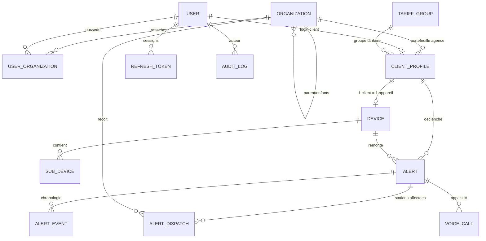

# Architecture — Zengo Account (plateforme SafAlert Solar G1)

> Documents sources : `ZENGO_ACCOUNT_plateforme_of__SafAlerte_solar_G1...pdf`
> (cahier des charges) et `Safety_GuardMQTTDOCUMENT.pdf` (protocole IoT du kit).

## 1. Vue d'ensemble

Zengo Account est le socle logiciel multi-tenant de l'écosystème SafAlert Solar G1.
Il assure la création et le cycle de vie des comptes clients, le rattachement des
dispositifs IoT, la tarification, la traçabilité, et — dans les itérations suivantes —
la gestion des alertes, du Zengo Monitoring Center (ZMC) et des interventions terrain.

```
Applications                 API Zengo Account                 Intégrations
─────────────────            ──────────────────────            ─────────────────
Web admin / ZMC  ─┐          ┌────────────────────┐            Kit SafAlert
Stations SRA      ├─ REST ──▶│  NestJS (monolithe │◀── MQTT ── (GSM/4G)
App client        │  HTTPS   │  modulaire)        │            Twilio / Dialogflow
App agents terrain┘          │  PostgreSQL        │            Mobile Money (webhooks)
                             └────────────────────┘            SMS / Push
```

Choix structurants pour cette première itération :

| Sujet | Décision | Raison |
|---|---|---|
| Backend | NestJS + TypeScript | Modules, DI, découpage par domaine, testabilité |
| Base | PostgreSQL + TypeORM | Contraintes relationnelles fortes, `jsonb`, enums, migrations |
| Multi-tenant | Hiérarchie d'`Organization` + appartenances utilisateur | Correspond à la structure National → Région → Agence → PDC |
| Auth | JWT d'accès court + refresh token opaque rotatif | Révocation immédiate, détection de réutilisation |
| Temps réel | MQTT (`{prefix}/{SN}/{platform}/{action}`) | Protocole imposé par le kit SafAlert |

## 2. Découpage en modules

```
src/
├── common/            # enums, DTO partagés, gardes, filtres, bus, utilitaires purs
│   ├── bus/           # AlertEventBus, TelephonyEventBus (modules globaux sans dépendance)
│   ├── enums/         # Role, OrganizationType, ClientStatus, AlertType, ArmMode...
│   ├── guards/        # JwtAuthGuard, RolesGuard
│   └── utils/         # identifiants, mots de passe, persistance, décodage d'état IoT
├── config/            # configuration typée + validation des variables d'env
├── database/
│   ├── entities/      # modèle de données
│   └── seeds/         # jeu de données initial (idempotent)
└── modules/
    ├── auth/          # connexion, refresh rotatif, 2FA TOTP
    ├── users/         # utilisateurs + appartenances (organisation, rôle)
    ├── organizations/ # hiérarchie + calcul de périmètre (OrganizationScopeService)
    ├── clients/       # comptes clients Zengo (ID unique, installation, dispositif)
    ├── devices/       # dispositifs SafAlert, sous-appareils, armement, présence
    ├── tariffs/       # groupes tarifaires, taux USD/CDF, boutons SOS
    ├── alerts/        # pipeline d'alertes, affectations, escalade, TwiML, watchdog
    ├── telephony/     # fournisseurs d'appel vocal (STUB / TWILIO) + webhooks
    ├── realtime/      # passerelle Socket.IO (diffusion des alertes)
    ├── iot/           # passerelle MQTT (entrant) + traduction des commandes
    ├── audit/         # journalisation automatique + consultation
    └── health/        # sonde applicative
```

## 3. Modèle de données (multi-tenant)



Points clés :

- **`Organization.path`** : chemin matérialisé `/nat/reg/agence` permettant de
  récupérer tous les descendants avec un `LIKE`, et donc de calculer le périmètre
  d'un utilisateur en une requête.
- **`UserOrganization`** porte le couple (organisation, rôle) : un technicien peut
  intervenir sur plusieurs agences, un compte institution peut avoir plusieurs utilisateurs.
- **`ClientProfile.zengoId`** : identifiant unique `ZGO-<CODE-AGENCE>-<NNNNNN>` généré
  à la création, avec nouvelle tentative en cas de collision concurrente.
- **`Device.clientId` unique** : un compte client est lié à un seul appareil
  (sauf packs sur mesure, à traiter dans une itération ultérieure).

## 4. Sécurité

| Mesure | Implémentation |
|---|---|
| Mots de passe | bcrypt (coût configurable), politique de robustesse, verrouillage après 5 échecs (15 min) |
| Sessions | JWT d'accès 15 min + refresh token opaque haché en base, rotation à chaque usage |
| Détection de vol de token | Réutilisation d'un refresh révoqué → révocation de toutes les sessions |
| 2FA | TOTP (otplib) avec QR code, activable par l'utilisateur |
| Autorisation | Rôle porté par l'appartenance + `RolesGuard` ; `SUPER_ADMIN` transversal |
| Cloisonnement | `OrganizationScopeService` : chaque requête est filtrée sur le sous-arbre autorisé |
| Temps réel | JWT exigé dans la poignée de main Socket.IO ; salles dérivées des appartenances |
| Webhooks de téléphonie | Signature `X-Twilio-Signature` (HMAC-SHA1) recalculée sur l'URL exacte ; fournisseur de test interdit en production |
| Tokens IoT | Empreinte SHA-256 uniquement ; token régénéré à chaque `auth`, vidé si le dispositif est désactivé |
| Traçabilité | `AuditInterceptor` : toute mutation authentifiée est journalisée, secrets masqués |
| Transport | `helmet`, CORS restreint par `CORS_ORIGINS`, rate limiting global (`@nestjs/throttler`) |
| Validation | `ValidationPipe` en liste blanche sur tous les DTO |

## 5. Passerelle IoT

Flux **entrant** : `MqttService` s'abonne à `{prefix}/+/device/+`, vérifie le token
du dispositif, puis alimente `DevicesService` (heartbeat, états des sous-appareils,
OTA) **et `AlertsService`** (alarmes → pipeline du ZMC décrit dans
[`ALERTES-ZMC.md`](./ALERTES-ZMC.md)).

Flux **sortant** : `DevicesService` publie une *intention* sur le `DeviceCommandBus` ;
`MqttService` la traduit en message MQTT. Ce découplage évite toute dépendance
circulaire entre les modules et rend le domaine testable sans broker.

Deux bus structurent l'application (`src/common/bus`), tous deux sans dépendance :

| Bus | Producteur | Consommateur |
|---|---|---|
| `DeviceCommandBus` | `DevicesService` | `MqttService` (commandes vers le kit) |
| `AlertEventBus` | `AlertsService` | `AlertGateway` (console temps réel) |
| `TelephonyEventBus` | webhooks de téléphonie | `AlertVoiceCallService` |

Détail du protocole : [`MQTT-SAFALERT.md`](./MQTT-SAFALERT.md).

## 6. Configuration

Toutes les variables sont validées au démarrage (`src/config/validate-environment.ts`) :
l'application refuse de démarrer si un port est invalide ou si les secrets JWT sont
absents en production. Voir `.env.example`.

## 7. Exploitation

- **Santé** : `GET /api/v1/health` (état de l'API et de la base).
- **Documentation** : `GET /docs` (OpenAPI/Swagger, hors production).
- **Journal d'audit** : `GET /api/v1/audit-logs` (direction, contrôle qualité).
- **Tâches planifiées** : watchdog d'escalade et d'appel (alertes), supervision de
  présence des dispositifs. Cadences configurables, exécutions non chevauchantes.
- **Vérification** : `npm run verify` (types + tests unitaires + build), puis
  `npm run smoke:all` (parcours bout en bout sur une instance lancée) et
  `npm run smoke:iot` (chaîne MQTT, broker embarqué).

## 8. Conventions de développement

- **Persistance** : ne jamais appeler `repository.save()` sur une entité dont les
  relations inverses ont été chargées — TypeORM réécrirait les clés étrangères
  des enfants à `NULL`. Utiliser `saveColumns()` (`src/common/utils/persistence.util.ts`).
- **Découplage inter-modules** : passer par un bus applicatif plutôt que par un
  import croisé ; le graphe de modules doit rester acyclique
  (`IotModule → AlertsModule`, jamais l'inverse).
- **Règles métier** : isoler la logique pure dans des fichiers testables sans base
  (`alert-rules.ts`, `voice-scripts.ts`, `dtmf.util.ts`).
- **Enums** : centralisés dans `src/common/enums`, jamais déclarés dans les entités.
