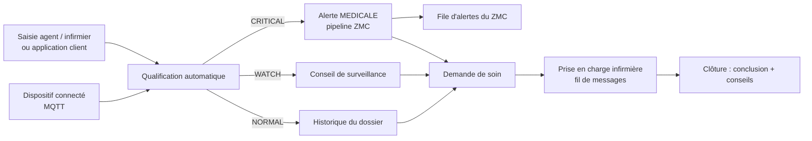

# Itération 6 — e-Santé connectée

La plateforme SafAlert Solar G1 n'est pas seulement un système d'alarme : elle
accompagne le **suivi préventif** de la santé du client (tensiomètre, oxymètre,
glucomètre, thermomètre, balance connectée). L'enjeu est double :

1. **détecter tôt** une valeur anormale et prévenir la complication ;
2. **protéger** des données sensibles — rien ne se consulte sans le
   consentement du client, et tout accès est journalisé.



## 1. Mesures de santé

Six grandeurs sont suivies (`HealthMetric`) :

| Grandeur | Unité | Valeur secondaire |
|---|---|---|
| `BLOOD_PRESSURE` | mmHg | diastolique (**obligatoire**) |
| `HEART_RATE` | bpm | — |
| `SPO2` | % | — |
| `BLOOD_GLUCOSE` | mg/dL | précision « à jeun » |
| `TEMPERATURE` | °C | — |
| `WEIGHT` | kg | taille en cm (pour l'IMC) |

Chaque mesure est **qualifiée à l'ingestion** par `classifyReading()`
(`src/common/utils/health.util.ts`) puis **figée** en base : le dossier reste
lisible même si les seuils cliniques évoluent.

| Statut | Signification | Suite donnée |
|---|---|---|
| `NORMAL` | valeur dans les normes | historique seul |
| `WATCH` | valeur à surveiller | conseil délivré au client |
| `CRITICAL` | valeur critique | **alerte MEDICALE** ouverte dans le pipeline du ZMC |

Référentiels appliqués : classification OMS/ESC de la tension (stade 1 ≥ 140/90,
stade 2 ≥ 160/100, poussée ≥ 180/110, hypotension < 90/60), OMS pour la glycémie
(à jeun : < 70 hypoglycémie, ≤ 99 normale, 100-125 prédiabète, ≥ 126
hyperglycémie ; hors jeun : < 140 normale, 140-199 élevée, ≥ 200
hyperglycémie), SpO₂ (< 90 hypoxie), température (< 35 hypothermie, ≥ 39,1
fièvre élevée) et IMC.

Une mesure critique :

- ouvre une alerte `MEDICAL` / gravité `CRITICAL` **sans appel vocal
  automatique** (contrairement à une intrusion : c'est le personnel de santé qui
  décide de l'escalade) ;
- est diffusée en temps réel au personnel (`health.critical_reading`).

### Origine des mesures

| Source | Voie d'entrée |
|---|---|
| `DEVICE` | MQTT `{prefix}/{SN}/device/health`, **token du dispositif exigé** |
| `MANUAL` | `POST /healthcare/measurements` (personnel de santé) |
| `CLIENT_APP` | `POST /healthcare/measurements` (le client, pour son dossier) |
| `IMPORT` | import de masse (campagne de dépistage) |

## 2. Consentement et traçabilité

Trois finalités (`HealthConsentScope`) :

| Portée | Effet |
|---|---|
| `DATA_SHARING` | le personnel de santé peut consulter les mesures |
| `NURSE_CONTACT` | le client accepte le contact / la téléconsultation infirmière |
| `EMERGENCY_DISCLOSURE` | divulgation aux secours en cas d'urgence vitale |

Règles :

- un consentement est valable s'il est `GRANTED`, non révoqué et non échu ;
- **le dernier enregistrement en date fait foi** : l'historique n'est jamais
  écrasé (preuve en cas de contrôle) ;
- un consentement actif ne peut pas être dupliqué (**409**) : il faut d'abord le
  retirer ;
- un consentement échu passe automatiquement en `EXPIRED` (tâche quotidienne
  01:00) ;
- **le client accède toujours à son propre dossier**, sans consentement ;
- le **personnel de santé est refusé (403)** sans consentement valide, sauf
  **accès d'urgence** (`?emergency=true` ou export d'urgence) qui est journalisé
  comme `EMERGENCY`.

Tout accès alimente `health_access_logs` : action (`VIEW`, `EXPORT`, `SHARE`,
`CONSENT_GRANTED`, `CONSENT_REVOKED`, `EMERGENCY`), acteur, rôle, motif, date.
Les écritures correspondantes sont aussi tracées dans le **journal d'audit
global** (`AuditAction.HEALTH_DATA_ACCESS`).

## 3. Demandes de soin / appel infirmier

Cycle de vie : `REQUESTED` → `IN_PROGRESS` (prise en charge) → `COMPLETED`
(clôture avec conclusion et conseils) ou `CANCELLED`.

- référence `NS-AAAAMMJJ-NNNN` générée avec le compteur du jour (réessai sur
  collision concurrente `23505`) ;
- **une seule demande ouverte par client** (409) ;
- priorité déduite des dernières mesures si elle n'est pas fournie :
  `EMERGENCY` si une mesure critique existe sur 30 jours, sinon `URGENT` si
  aucune mesure sur 7 jours, sinon `ROUTINE` ;
- délais de prise en charge attendus : **10 min** (urgence vitale), **60 min**
  (urgente), **4 h** (routine) ; un dépassement est signalé (`late`) ;
- une priorité `EMERGENCY` ouvre une **alerte médicale** dans le pipeline du ZMC ;
- le fil de suivi conserve les échanges **et** les événements système (prise en
  charge, clôture, annulation) ;
- une demande clôturée n'accepte plus de messages (400).

## 4. API

| Méthode | Route | Rôles | Description |
|---|---|---|---|
| `POST` | `/api/v1/healthcare/measurements` | personnel de santé, client | enregistrer une mesure |
| `GET` | `/api/v1/healthcare/measurements` | personnel de santé | historique (client, grandeur, statut, période, origine, critiques seules) |
| `GET` | `/api/v1/healthcare/measurements/stats` | personnel de santé | indicateurs de suivi |
| `GET` | `/api/v1/healthcare/clients/:id` | personnel de santé, client | dossier : dernières valeurs, tendances, critiques récentes (`?emergency=true`) |
| `GET` | `/api/v1/healthcare/clients/:id/measurements` | personnel de santé, client | historique détaillé |
| `GET` | `/api/v1/healthcare/clients/:id/consents` | personnel de santé, client | consentements |
| `POST` | `/api/v1/healthcare/clients/:id/consents` | personnel de santé, client | octroyer un consentement |
| `PATCH` | `/api/v1/healthcare/clients/:id/consents/revoke` | personnel de santé, client | retirer un consentement |
| `GET` | `/api/v1/healthcare/clients/:id/access-logs` | personnel de santé | journal d'accès |
| `POST` | `/api/v1/healthcare/clients/:id/export` | personnel de santé | export motivé et tracé |
| `GET` | `/api/v1/healthcare/clients/:id/nurse-requests` | personnel de santé, client | demandes de soin du client |
| `POST` | `/api/v1/healthcare/nurse-requests` | personnel de santé, opérateur, superviseur, client | ouvrir une demande |
| `GET` | `/api/v1/healthcare/nurse-requests` | personnel de santé | file (statut, priorité, non clôturées, mes prises en charge) |
| `GET` | `/api/v1/healthcare/nurse-requests/stats` | personnel de santé | délais, retards, volume |
| `GET` | `/api/v1/healthcare/nurse-requests/:id` | personnel de santé | détail |
| `PATCH` | `/api/v1/healthcare/nurse-requests/:id/accept` | personnel de santé | prise en charge |
| `POST` | `/api/v1/healthcare/nurse-requests/:id/messages` | personnel de santé, client | message dans le fil |
| `PATCH` | `/api/v1/healthcare/nurse-requests/:id/complete` | personnel de santé | clôture |
| `PATCH` | `/api/v1/healthcare/nurse-requests/:id/cancel` | demandeur, personnel de santé | annulation |
| `GET` | `/api/v1/healthcare/stats` | personnel de santé | synthèse e-santé |

> ⚠️ Le module `healthcare` est **distinct du module `health`**, qui expose la
> sonde technique `GET /health` (état de l'API et de la base).

## 5. Modèle de données

| Table | Rôle |
|---|---|
| `client_health_measurements` | une ligne par mesure : grandeur, valeur(s), unité, statut, label clinique, origine, dispositif, auteur, `alert_id` |
| `health_consents` | un enregistrement par octroi/retrait (portée, statut, canal, échéance, texte présenté au client) |
| `health_access_logs` | journal d'accès (action, acteur, rôle, motif, adresse IP, date) |
| `nurse_requests` | demande de soin : référence, priorité, statut, prise en charge, conclusion, conseils, fil `messages`, `alert_id` |

## 6. Temps réel

`HealthEventBus` diffuse `health.measurement_recorded`, `health.critical_reading`,
`health.consent_changed`, `health.nurse_request_created`,
`health.nurse_request_updated` et `health.nurse_request_message`. La passerelle
Socket.IO les pousse à l'organisation du client **et** à la salle `national`
(personnel habilité), en ne transportant qu'un résumé : aucune valeur clinique
ne transite par le canal temps réel.

## 7. Tâches planifiées

| Tâche | Fréquence | Rôle |
|---|---|---|
| Expiration des consentements | tous les jours à 01:00 | bascule `GRANTED` → `EXPIRED` |
| Relance des clients silencieux | tous les jours à 08:00 | client suivi sans mesure depuis 30 jours |
| Relance des demandes en retard | tous les jours à 09:00 | demande non prise en charge au-delà de son délai |

## 8. Console web — écran « Santé connectée »

Route `/sante` (`web/src/routes/HealthPage.tsx`) :

- quatre indicateurs : mesures suivies, valeurs critiques sur 24 h, demandes de
  soin ouvertes (dont hors délai), délai moyen de prise en charge ;
- **Dossier client** : bandeau de consentement (accorder / retirer par finalité,
  mode urgence), cartes par grandeur (valeur, qualification, conseil, tendance,
  nombre de mesures), tableau des valeurs critiques récentes (avec l'alerte ZMC
  associée), historique détaillé, formulaire de saisie de mesure ;
- **Demandes de soin** : file filtrable, tiroir de détail avec fil de messages,
  prise en charge, clôture (conclusion + conseils) et annulation ;
- **Traçabilité** : journal d'accès du dossier (qui a vu quoi, quand, pourquoi).

## 9. Tests

| Suite | Portée |
|---|---|
| `src/common/utils/health.util.spec.ts` | 30 tests : tensions (stades, poussée, hypotension), glycémie à jeun et hors jeun, fréquence cardiaque, SpO₂, température, IMC, tendances, consentement (accordé, révoqué, échu, urgence), délais des demandes de soin |
| `scripts/smoke-health.mjs` | **59 vérifications** bout en bout : sécurité (401/403), qualification automatique des mesures, alerte médicale sur valeur critique, sans/avec consentement, accès d'urgence tracé, non-duplication et retrait du consentement, export motivé, cycle complet d'une demande de soin, indicateurs, nettoyage (alertes du test clôturées) |

```bash
npm test               # 223 tests unitaires, 18 suites
npm run smoke:health   # 59 vérifications
npm run smoke:all      # 328 vérifications
```

## 10. Comptes utiles

| Compte | Rôle | Usage |
|---|---|---|
| `sante@zengo.cd` | `HEALTH_STAFF` | personnel de santé (portée nationale) |
| `client.demo@zengo.cd` | client | dossier de démonstration, accès à ses propres mesures |

Mot de passe de démonstration : `Zengo@2026` (client : `Client@2026`).

## 11. Reste à faire

- [ ] Application mobile client dédiée (saisie des mesures, appel infirmier,
      notifications) ;
- [ ] Messagerie temps réel avec pièces jointes (ordonnances, photos) ;
- [ ] Connecteurs constructeurs (tensiomètres Bluetooth, CGM) et import de masse
      depuis les campagnes de dépistage ;
- [ ] Tableau de bord épidémiologique par zone (agrégats anonymisés) et
      notifications de prévention.
