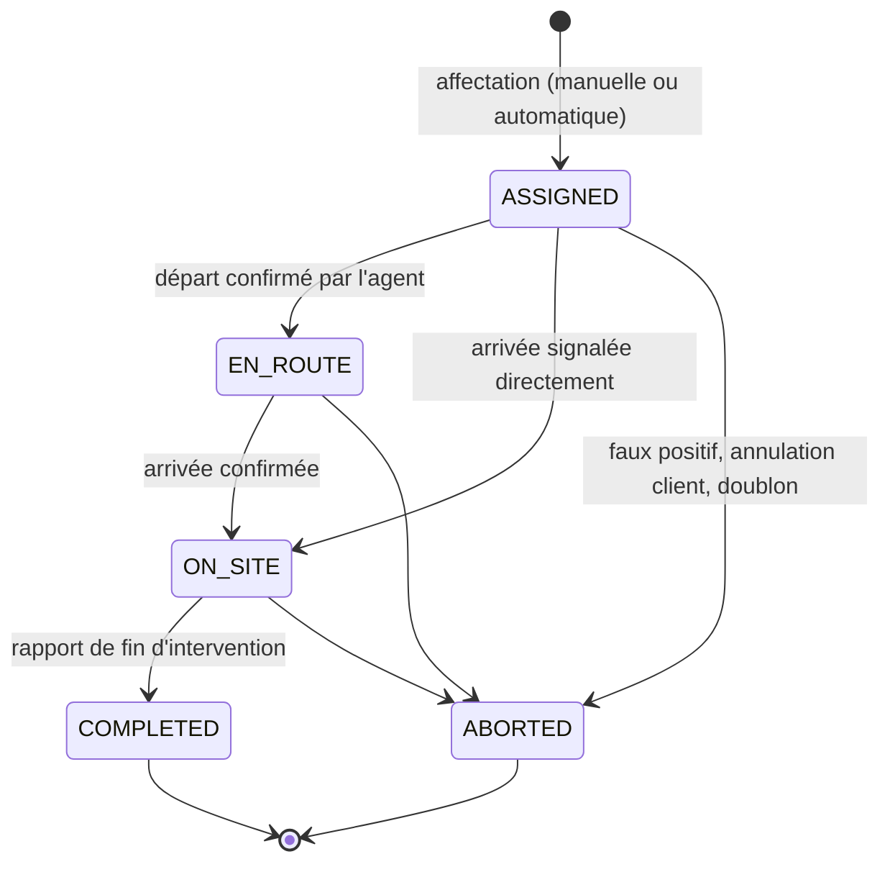

# Interventions terrain

Itération 3 du cahier des charges : **application mobile des intervenants** et
**coordination des missions** entre le Zengo Monitoring Center, les chambres de
secours et les équipes de terrain.

> Vocabulaire. Une **alerte** est un événement détecté. Une **affectation**
> (`alert_dispatches`) est l'envoi d'une alerte à une station. Une
> **intervention** est la mission confiée à une **équipe terrain** désignée
> pour agir. Une alerte peut donner lieu à plusieurs missions.

---

## 1. Cycle de vie d'une mission

| Statut | Signification | Effet sur l'alerte |
|---|---|---|
| `ASSIGNED` | Mission confiée, départ non confirmé | `NEW` / `ACKNOWLEDGED` → `ASSIGNED` |
| `EN_ROUTE` | Équipe en route | inchangée |
| `ON_SITE` | Équipe arrivée | → `IN_PROGRESS` |
| `COMPLETED` | Rapport déposé | clôture selon la conclusion du rapport |
| `ABORTED` | Mission abandonnée | inchangée (une autre équipe peut être engagée) |

Les retours en arrière sont refusés : `ASSIGNED → EN_ROUTE → ON_SITE → COMPLETED`
(un saut direct `ASSIGNED → ON_SITE` reste possible si l'agent n'a pas confirmé
son départ).

---

## 2. Affectation de l'équipe la plus proche

`POST /interventions` sans `teamId` déclenche l'affectation automatique
(« Localisation GPS intelligente » du cahier des charges) :

1. **Candidats** — équipes `AVAILABLE`, actives, du périmètre de l'utilisateur.
2. **Spécialité** — la famille d'équipe est déduite du type d'alerte :

   | Alerte | Équipes éligibles |
   |---|---|
   | incendie, fuite de gaz, fuite d'eau | `FIRE`, `MIXED` |
   | urgence médicale | `MEDICAL`, `MIXED` |
   | intrusion, sabotage, bouton panique | `INTRUSION`, `MIXED` |
   | incident système | toutes |

3. **Position exploitable** — position connue et âgée de moins d'une heure
   (`INTERVENTION_POSITION_MAX_AGE_MINUTES`). Une position périmée est écartée :
   mieux vaut un choix manuel qu'un calcul faux.
4. **Distance** — distance orthodromique (haversine) au lieu d'intervention,
   tri croissant ; l'ETA est estimée à `INTERVENTION_AVERAGE_SPEED_KMH`.

Point de référence : le lieu de l'alerte, **à défaut le siège de l'agence
porteuse** (ses stations sont de toute façon les destinataires). Sans aucun
repère, l'API répond `400` et invite à désigner l'équipe manuellement.

L'affectation manuelle (`teamId`) reste prioritaire et trace son auteur.

---

## 3. Suivi GPS

- `POST /field-teams/:id/position` — remontée depuis l'application mobile de
  l'agent (`APP`) ou un boîtier véhicule (`GPS_TRACKER`).
- Chaque relevé est conservé dans `team_positions` (append-only) et met à jour
  la dernière position connue de l'équipe (dénormalisée pour l'affectation).
- Le relevé est **rattaché automatiquement à la mission en cours** de l'équipe
  (champ `interventionId` optionnel pour forcer une autre mission). La trace
  d'une mission ne mélange donc pas les trajets de ses missions précédentes ;
  en l'absence de relevés rattachés, le suivi retombe sur l'historique de
  l'équipe.
- `GET /interventions/:id/track` — relevés de la mission, position courante,
  **distance et ETA restantes** vers le lieu d'intervention.
- Diffusion temps réel : `team.position_updated`, `team.status_changed`.

---

## 4. Rapport de fin d'intervention

`POST /interventions/:id/report` clôture la mission avec :

| Champ | Rôle |
|---|---|
| `outcome` | Conclusion (voir ci-dessous) |
| `summary` | Synthèse — devient le **compte rendu officiel** de l'alerte |
| `actionsTaken`, `damages` | Actions menées, dégâts constatés |
| `peopleAssisted` | Nombre de personnes prises en charge |
| `photos` | Références des photos (le binaire ne transite pas par la base) |
| `signatureName` | Nom du signataire du bon de réception |
| `closeAlert` | Clôture l'alerte (par défaut `true`) |
| `clientNotified` | Le client a été informé de la clôture |

Conclusion → classement de l'alerte :

| `outcome` | Statut d'alerte | Classement |
|---|---|---|
| `RESOLVED_ON_SITE` | `RESOLVED` | `HANDLED_BY_TEAM` |
| `FALSE_ALARM_ON_SITE` | `FALSE_ALARM` | `NO_ACTION_REQUIRED` |
| `NO_ACTION_REQUIRED` | `RESOLVED` | `NO_ACTION_REQUIRED` |
| `DAMAGE_REPORTED` | `RESOLVED` | `HANDLED_BY_TEAM` |
| `HANDOVER_TO_AUTHORITIES` | `RESOLVED` | `HANDLED_BY_TEAM` |
| `CLIENT_ABSENT` | `RESOLVED` | `NO_ACTION_REQUIRED` |
| `EQUIPMENT_ISSUE` | `FALSE_ALARM` | `TECHNICAL_ISSUE` |

Avec `closeAlert: false`, l'alerte reste ouverte (le ZMC décide) mais le rapport
est consigné dans la chronologie.

---

## 5. Watchdog de pilotage

Tâche planifiée (`InterventionsTasks`, cadence
`INTERVENTION_WATCHDOG_INTERVAL_SECONDS`) :

1. **Départ non confirmé** — mission `ASSIGNED` depuis plus de
   `INTERVENTION_DEPARTURE_WARN_MINUTES` (5 min par défaut) → événement
   `intervention.delayed` (`reason: DEPARTURE_NOT_CONFIRMED`).
2. **Arrivée anormale** — mission `EN_ROUTE` sans arrivée depuis plus de
   `INTERVENTION_ARRIVAL_WARN_MINUTES` (45 min) → `intervention.delayed`
   (`reason: ARRIVAL_LATE`).
3. **Équipe silencieuse** — position plus ancienne que
   `INTERVENTION_POSITION_MAX_AGE_MINUTES` → événement `team.position_updated`
   avec `stale: true`.

Aucun changement de statut n'est automatique : le watchdog **signale**, la
décision reste humaine.

---

## 6. API

### Équipes — `/field-teams`

| Méthode | Route | Rôles |
|---|---|---|
| `POST` | `/` | encadrement (super admin → chef d'agence) |
| `GET` | `/?status=&speciality=&stationId=&organizationId=&availableOnly=&withPositionOnly=&nearLatitude=&nearLongitude=` | tous (périmètre) |
| `GET` | `/:id` | tous (périmètre) |
| `GET` | `/:id/positions?limit=` | tous (périmètre) |
| `PATCH` | `/:id` | encadrement |
| `PATCH` | `/:id/status` | encadrement |
| `POST` | `/:id/position` | agents (station, terrain, santé), ZMC, encadrement |

Le tri par distance (`nearLatitude` / `nearLongitude`) permet l'écran
« équipes disponibles les plus proches » de la console.

### Missions — `/interventions`

| Méthode | Route | Rôles |
|---|---|---|
| `POST` | `/` | ZMC, encadrement, stations |
| `GET` | `/?status=&openOnly=&alertId=&teamId=&stationId=&organizationId=&from=&to=&search=` | tous (périmètre) |
| `GET` | `/stats` | tous (périmètre) |
| `GET` | `/by-alert/:alertId` | tous (périmètre) |
| `GET` | `/:id` | tous (périmètre) |
| `GET` | `/:id/track` | tous (périmètre) |
| `POST` | `/:id/en-route` | agents + ZMC + encadrement |
| `POST` | `/:id/on-site` | agents + ZMC + encadrement |
| `POST` | `/:id/report` | agents + ZMC + encadrement |
| `POST` | `/:id/abort` | ZMC + encadrement |

Indicateurs `GET /interventions/stats` : total, missions en cours, répartition
par statut, volume 24 h, **délai moyen d'arrivée**, **durée moyenne**, taux de
réalisation, missions en retard.

---

## 7. Temps réel

Namespace `/realtime` (mêmes salles que les alertes : agence, zone, national,
stations affectées).

| Événement | Charge utile |
|---|---|
| `intervention.assigned` | équipe, distance, ETA, affectation automatique ou non |
| `intervention.status_changed` | nouveau statut, note |
| `intervention.completed` | conclusion, durée, nombre de photos |
| `intervention.aborted` | motif |
| `intervention.delayed` | `DEPARTURE_NOT_CONFIRMED` / `ARRIVAL_LATE` |
| `team.status_changed` | disponibilité de l'équipe |
| `team.position_updated` | position, vitesse, `stale` |

---

## 8. Sécurité et périmètre

- Écriture des positions et avancement de mission réservés aux agents
  (`FIELD_AGENT`, `HEALTH_STAFF`, `STATION_AGENT`) et au ZMC.
- Un opérateur d'agence ne peut engager que les équipes de son périmètre
  (`OrganizationScopeService`) ; les requêtes hors périmètre répondent `403`.
- Un client final ne voit aucune mission (`403`).
- Toutes les actions sensibles sont auditées (`@Audit`) : création d'équipe,
  affectation, transitions, rapport, abandon.

---

## 9. Configuration

| Variable | Défaut | Rôle |
|---|---|---|
| `INTERVENTION_WATCHDOG_INTERVAL_SECONDS` | `60` | Cadence du watchdog |
| `INTERVENTION_DEPARTURE_WARN_MINUTES` | `5` | Départ non confirmé |
| `INTERVENTION_ARRIVAL_WARN_MINUTES` | `45` | Trajet anormalement long |
| `INTERVENTION_POSITION_MAX_AGE_MINUTES` | `60` | Fraîcheur d'une position |
| `INTERVENTION_AVERAGE_SPEED_KMH` | `28` | Vitesse moyenne pour l'ETA |

---

## 10. Tests

| Suite | Périmètre | Résultat |
|---|---|---|
| `geo.util.spec.ts` | haversine, cap, ETA, coordonnées | 10 tests |
| `intervention-rules.spec.ts` | transitions, sélection de la plus proche, watchdog | 15 tests |
| `npm run smoke:interventions` | parcours complet (48 contrôles) | ✅ |

Le test de fumée couvre : équipes et filtres, affectation automatique (équipe
la plus proche, distance et ETA), événement temps réel, synchronisation de
l'alerte, transitions, refus de transition incohérente, trace GPS rattachée à la
mission, rapport et clôture, statistiques, sécurité (client, anonyme, hors
périmètre) et abandon.

Les positions vieillissent : l'affectation automatique ignore les relevés de
plus d'une heure. Le test rafraîchit donc les positions des équipes depuis leur
poste avant de demander l'affectation, ce qui rend le résultat déterministe quel
que soit l'âge des données.
