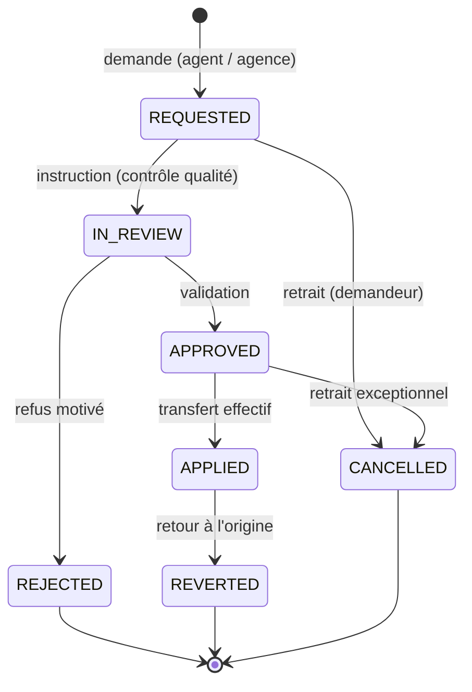

# Itération 5 — Mutation géographique des dossiers clients

Un client peut changer de zone d'intervention (déménagement, erreur d'affectation,
optimisation de couverture, litige commercial…). Le dossier doit alors passer d'une
agence à une autre **sans perte d'information** : équipements, abonnement, alertes en
cours et centres de secours doivent suivre le client.

La mutation géographique est donc un **workflow à double validation** :

1. un agent (ou un responsable d'agence) **demande** la mutation ;
2. le **contrôle qualité** valide ou refuse ;
3. l'agence d'origine **applique** le transfert (ou **annule** la demande avant application) ;
4. l'intégration du client est **suivie à J+7 et J+30**.



## 1. Conditions à remplir

Une demande n'est acceptée que si :

| Condition | Règle |
|---|---|
| Agence de destination | doit être de type `AGENCY` (HTTP 400 sinon) |
| Portée | l'utilisateur doit pouvoir accéder à l'agence de destination (hors périmètre → 403) |
| Agence différente | la destination doit différer de l'agence actuelle du client |
| Dossier ouvert | un client `ARCHIVED` ne peut pas être muté |
| Unicité | un seul dossier de mutation **ouvert** par client (HTTP 409 `OPEN_MUTATION_EXISTS`) |

## 2. Double validation

Le contrôle `canValidateMutation()` (`src/common/utils/mutation.util.ts`) impose :

- **acteur différent** du demandeur (`SAME_ACTOR`) — un agent ne peut pas valider sa
  propre demande, même s'il porte le rôle ;
- **rôle qualité requis** (`MISSING_QUALITY_ROLE`) : `QUALITY_DIRECTOR`,
  `NATIONAL_DIRECTOR`, `TECHNICAL_DIRECTOR` ou `SUPER_ADMIN` ;
- **décision encore possible** (`ALREADY_DECIDED`) : seul un dossier `REQUESTED` ou
  `IN_REVIEW` peut être tranché.

Un **refus exige un commentaire** (`rejectionReason`), un accord accepte un commentaire
libre (`reviewComment`).

## 3. Application du transfert

`PATCH /client-mutations/:id/apply` exécute une transaction unique :

1. le `ClientProfile` est rattaché à la nouvelle organisation (agence **et** région) ;
2. les `Device` du client suivent (`organizationId`), les `SubDevice` suivent
   automatiquement car ils héritent de l'organisation de leur centrale parente ;
3. si la **région change**, les alertes encore ouvertes sont **redirigées** vers les
   stations de secours de la nouvelle région et comptabilisées (`alertsRedirected`) ;
4. la **charge du dossier** est figée dans `caseLoadSummary` (alertes, interventions et
   abonnements repris) ;
5. `regionChanged`, `appliedAt/ById/Label` et la liste des services notifiés sont
   enregistrés.

Hors transaction, le client est prévenu par **SMS** (gabarit `MUTATION_APPLIED`, en
français, anglais, swahili, lingala, chiluba et kikongo) — l'horodatage de l'envoi est
conservé dans `clientNotifiedAt`. Un échec d'envoi ne remet pas en cause le transfert.

`describeTransferImpact()` documente l'impact avant application :

| Situation | Conséquences |
|---|---|
| même région | `regionChanged = false`, aucune redirection d'alerte |
| changement de région, aucune alerte ouverte | pas de redirection, mais stations de secours recalculées |
| changement de région **avec** alertes ouvertes | `redirectOpenAlerts = true` + « Stations de secours » listées |

## 4. Retour à l'origine et retrait

- `PATCH /client-mutations/:id/revert` : remet le client dans son agence d'origine et
  redirige de nouveau les alertes ouvertes si la région change. Le motif est obligatoire.
- `PATCH /client-mutations/:id/cancel` : retrait par le demandeur **avant** application
  (statuts `REQUESTED`, `IN_REVIEW`, `APPROVED`), motif obligatoire.

## 5. Suivi d'intégration J+7 / J+30

À l'application, deux échéances sont créées : **J+7** et **J+30**
(`integrationDueAt()`). L'agence d'accueil renseigne un bilan via
`POST /client-mutations/:id/integration-report` :

| Résultat | Signification |
|---|---|
| `SATISFACTORY` | intégration satisfaisante |
| `ISSUES_REPORTED` | difficultés signalées |
| `CLIENT_LOST` | client perdu / désabonné |
| `PENDING` | en attente |

- un rapport déjà déposé pour une échéance renvoie **409** ;
- une tâche planifiée (`@Cron` quotidien 09:00) relance les rapports manquants
  (au plus **un rappel par jour et par dossier**, `lastReminderAt`) ;
- un rapport est considéré **en retard** au-delà de **5 jours** de grâce
  (`isIntegrationReportLate()`), ce qui alimente `integrationLate` dans les statistiques ;
- `GET /client-mutations/pending-reports` liste les dossiers en attente de bilan.

## 6. API

| Méthode | Route | Rôles | Description |
|---|---|---|---|
| `POST` | `/api/v1/client-mutations` | rôles de demande | ouvrir une demande |
| `GET` | `/api/v1/client-mutations` | tous | journal paginé (statut, motif, période, recherche) |
| `GET` | `/api/v1/client-mutations/stats` | tous | indicateurs (statuts, motifs, délai moyen, retards) |
| `GET` | `/api/v1/client-mutations/pending-reports` | application + superviseur | rapports d'intégration attendus |
| `GET` | `/api/v1/client-mutations/clients/:clientId` | tous | mutations d'un client (courante, origine, en attente) |
| `GET` | `/api/v1/client-mutations/:id` | tous | détail d'un dossier |
| `PATCH` | `/api/v1/client-mutations/:id/review` | `QUALITY_DIRECTOR`, `NATIONAL_DIRECTOR`, `TECHNICAL_DIRECTOR`, `SUPER_ADMIN` | valider / refuser |
| `PATCH` | `/api/v1/client-mutations/:id/apply` | application | transfert effectif |
| `PATCH` | `/api/v1/client-mutations/:id/revert` | application | retour à l'origine |
| `PATCH` | `/api/v1/client-mutations/:id/cancel` | demandeur / administration | retrait avant application |
| `POST` | `/api/v1/client-mutations/:id/integration-report` | application | bilan J+7 / J+30 |

> ⚠️ Dans NestJS, `@Get(':id')` est déclaré **en dernier** : une route littérale comme
> `/stats` ou `/pending-reports` serait sinon interprétée comme un identifiant.

## 7. Modèle de données

Table `client_mutations` (entité `ClientMutation`) :

| Groupe | Colonnes |
|---|---|
| Identification | `reference` (unique, `MU-AAAAMMJJ-NNNN`), `type` (`TRANSFER`/`RETURN`) |
| Client | `clientId`, `clientCode`, `clientName` |
| Origine / destination | `fromOrganizationId/Label`, `fromRegionId/Label`, `toOrganizationId/Label`, `toRegionId/Label` |
| Motif | `reason`, `note` |
| Demande | `requestedById/Label/At` |
| Instruction | `status`, `reviewedById/Label/At`, `reviewComment`, `rejectionReason` |
| Application | `appliedAt/ById/Label`, `regionChanged`, `alertsRedirected`, `caseLoadSummary` (jsonb), `servicesNotified` (jsonb), `clientNotifiedAt` |
| Retour | `revertedAt`, `revertedByLabel`, `revertedReason` |
| Retrait | `cancelledAt`, `cancellationReason` |
| Intégration | `integration7At/Outcome/Note`, `integration30At/Outcome/Note`, `lastReminderAt` |
| Divers | `metadata`, colonnes d'audit |

La référence est générée par `buildMutationReference()` avec le compteur du jour ; en cas
de collision concurrente (SQLSTATE `23505`) la création réessaie automatiquement.

## 8. Temps réel

`MutationEventBus` diffuse `mutation.requested`, `mutation.approved`,
`mutation.rejected`, `mutation.applied`, `mutation.reverted`,
`mutation.integration_report` et `mutation.reminder`. `AlertGateway` les pousse aux
salles Socket.IO des organisations d'origine et de destination **et** à la salle
`national`, ce qui permet au contrôle qualité de suivre les demandes en direct.

## 9. Console web — écran « Mutations »

`web/src/routes/MutationsPage.tsx` (route `/mutations`) propose :

- quatre indicateurs : demandes (90 j), dossiers transférés, délai moyen d'instruction,
  rapports d'intégration (dont en retard) ;
- le journal filtrable (statut, motif, recherche, « en cours d'instruction ») avec suivi
  J+7 / J+30 par ligne ;
- le formulaire **« Demander une mutation »** (client, agence de destination, motif, note) ;
- un tiroir de détail : carte *Double validation*, carte *Transfert* (charge du dossier,
  changement de région, alertes redirigées, notification client) et cartes
  *Suivi de l'intégration* avec dépôt du bilan ;
- les actions de validation / refus / application / retour / retrait, filtrées par rôle.

## 10. Tests

| Suite | Portée |
|---|---|
| `src/common/utils/mutation.util.spec.ts` | 24 tests : transitions, références, double validation, impact du transfert, échéances d'intégration |
| `scripts/smoke-mutations.mjs` | 46 vérifications bout en bout : conditions, 409, double validation, application (équipements, alertes, SMS), rapports J+7/J+30 + 409, retour, retrait, statistiques, sécurité (401/403), nettoyage |

```bash
npm test                    # 193 tests unitaires, 17 suites
npm run smoke:mutations     # 46 vérifications
npm run smoke:all           # 269 vérifications (socle + alertes + interventions + abonnements + mutations)
```

## 11. Comptes utiles

| Compte | Rôle | Usage |
|---|---|---|
| `plateforme@zengo.cd` | `PLATFORM_MANAGER` | demandeur de mutation |
| `qualite@zengo.cd` | `QUALITY_DIRECTOR` | seconde validation (contrôle qualité) |
| `client.demo@zengo.cd` | client | destinataire du SMS de confirmation |

Mot de passe de démonstration : `Zengo@2026`.

## 12. Reste à faire

- [ ] Notification automatique des **services internes** (technique, finance) à
      l'application du transfert (la liste `servicesNotified` est prête) ;
- [ ] Notification dans l'**application mobile client** en complément du SMS ;
- [ ] Rapport de synthèse mensuel des mutations par agence (rattaché au futur tableau de
      bord finance).
