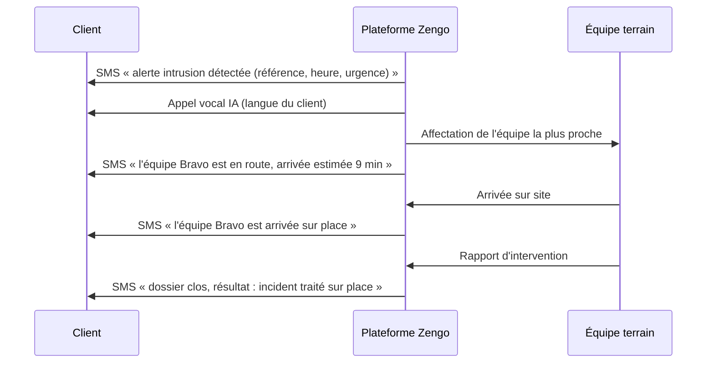

# Canal SMS — notification du client

Le cahier des charges demande que le client soit prévenu **par SMS en parallèle
de l'appel vocal IA** : l'appel qualifie le risque, le SMS laisse une trace
écrite que le client peut relire, même s'il n'a pas décroché.

---

## 1. Quand la plateforme écrit au client

| Situation | Déclencheur | Modèle | Variables |
|---|---|---|---|
| Alerte détectée | création de l'alerte (capteur, bouton SOS, opérateur) | `ALERT_RAISED` | référence, nature, heure, adresse, numéro d'urgence |
| Événement confirmé | le client confirme l'intrusion (DTMF 1 ou ASR) | `ALERT_CONFIRMED` | référence, numéro d'urgence |
| Équipe en route | affectation d'une mission | `MISSION_ASSIGNED` | nom de l'équipe, délai estimé (ETA) |
| Équipe sur place | arrivée confirmée par l'équipe | `MISSION_ON_SITE` | nom de l'équipe |
| Dossier clos | rapport d'intervention | `ALERT_CLOSED` | résultat constaté |
| Message libre | rédaction depuis la console | `CUSTOM` | corps saisi par le superviseur |

Chaque envoi est écrit dans la chronologie du dossier (`SMS_SENT`) et dans le
journal d'audit.

### Les trois étapes annoncées au client



Un échec d'envoi n'interrompt jamais le traitement de l'alerte ou de la
mission : le message reste visible en échec dans le dossier et peut être renvoyé
depuis la console.

---

## 2. Multilingue

Le client reçoit son SMS dans la langue enregistrée sur sa fiche Zengo
(`preferredLanguage`), comme pour l'appel vocal :

`fr` · `en` · `sw` · `ln` · `lu` · `kg`

Les textes sont dans `src/modules/telephony/sms-templates.ts`. Les versions
française et anglaise sont validées ; les quatre autres sont des traductions de
première passe à faire relire par un locuteur natif avant mise en production.

### Variables et nettoyage

Un modèle utilise `{nomVariable}`. Une variable absente est **retirée** du texte
plutôt qu'affichée en clair : le client ne doit jamais recevoir
`chez vous à {address}`. Les espaces parasites sont ensuite nettoyés, en
conservant l'espace avant les deux-points (typographie française).

```ts
renderSmsTemplate(SmsTemplate.MISSION_ON_SITE, Language.FRENCH, {
  reference: 'IN-20261003-0002',
});
// « Zengo : l equipe est arrivee sur place (IN-20261003-0002). »
```

### Facturation des segments

L'encodage est détecté automatiquement (table GSM 03.38) :

| Encodage | 1 segment | Segment suivant | Remarque |
|---|---|---|---|
| GSM-7 | 160 caractères | 153 | `é è ù ç Ø Å Δ Φ Ω` sont GSM-7 |
| UCS-2 | 70 caractères | 67 | `ê à ô î — …` et les emojis forcent l'UCS-2 |

Les caractères étendus GSM (`{ } [ ] ~ ^ \ | €`) comptent double. Le nombre de
segments facturés est stocké sur chaque message, ce qui permet de suivre le coût
réel du canal.

---

## 3. Fournisseurs

| Fournisseur | Envoi réel | Usage |
|---|---|---|
| `STUB` | non (tracé dans les logs et en base) | développement, tests de fumée |
| `TWILIO` | oui (API Messages) | production |

Le fournisseur `STUB` est **refusé en production** par la fabrique du module :
le client croirait être notifié alors qu'aucun SMS ne partirait.

```bash
SMS_ENABLED=true
SMS_PROVIDER=TWILIO
TWILIO_ACCOUNT_SID=AC...
TWILIO_AUTH_TOKEN=...
TWILIO_SMS_FROM=+243...
# ou, si vous utilisez un pool d'expéditeurs :
TWILIO_MESSAGING_SERVICE_SID=MG...
SMS_STATUS_CALLBACK_URL=https://api.zengo.cd/api/v1/sms/webhooks/twilio/status
SMS_EMERGENCY_PHONE=+243 970 255 599
```

Sans SDK : l'API REST est appelée directement (même approche que la voix).

---

## 4. Accusés de remise

Le fournisseur rappelle l'API à chaque changement d'état :

```
POST /api/v1/sms/webhooks/:provider/status
```

| Statut fournisseur | Statut interne |
|---|---|
| `queued`, `accepted`, `sending`, `sent` | `SENT` (accepté) |
| `delivered` | `DELIVERED` (remis) |
| `undelivered` | `UNDELIVERED` |
| `failed` | `FAILED` |
| inconnu | `QUEUED` |

Un message déjà remis n'est jamais dégradé par un accusé tardif ; les
opérateurs émettent parfois `sent` après `delivered`.

---

## 5. API

Authentification JWT requise, sauf mention contraire. Le périmètre de
l'utilisateur est vérifié avant tout envoi ou lecture.

| Méthode | Route | Rôles | Rôle |
|---|---|---|---|
| `GET` | `/alerts/:id/sms` | tous (périmètre) | historique des messages du dossier |
| `POST` | `/alerts/:id/sms` | encadrement, ZMC, superviseurs | message libre au client |
| `POST` | `/sms/:id/resend` | encadrement, ZMC, superviseurs | renvoi (nouveau message tracé) |
| `GET` | `/sms/stats` | authentifié | volumes, taux d'acceptation, taux de remise, segments |
| `POST` | `/sms/webhooks/:provider/status` | public (throttlé) | accusé de remise du fournisseur |

`GET /alerts/:id/sms` est aussi accessible au **client** propriétaire du
dossier : il peut relire ce que le centre lui a annoncé.

---

## 6. Modèle de données

`SmsMessage` (`sms_messages`) — append-only du point de vue métier : seuls les
champs de remise évoluent.

| Champ | Rôle |
|---|---|
| `alertId`, `clientId`, `interventionId` | rattachement au dossier, au client et à la mission |
| `direction`, `template`, `language` | nature et langue du message |
| `provider`, `providerMessageId` | traçabilité fournisseur |
| `toNumber`, `fromNumber` | destinataire et expéditeur |
| `body`, `encoding`, `segments` | corps envoyé, encodage, segments facturés |
| `status`, `attemptNumber` | état de remise et numéro de tentative |
| `errorCode`, `errorMessage` | motif d'échec renvoyé par l'opérateur |
| `queuedAt`, `sentAt`, `deliveredAt` | jalons de remise |
| `costUsd` | coût annoncé par l'opérateur |
| `metadata` | contexte du rendu (variables du modèle) |

---

## 7. Console

Onglet **SMS client** du panneau d'alerte :

- corps exact envoyé, langue, encodage et segments ;
- statut de remise et horodatage de livraison ;
- bouton **Renvoyer** sur chaque message ;
- zone de rédaction d'un message libre (3 à 640 caractères).

Les messages en échec sont signalés en tête de liste avec un bandeau
d'avertissement.

---

## 8. Tests

| Suite | Périmètre | Résultat |
|---|---|---|
| `sms-templates.spec.ts` | rendu multilingue, variables absentes, seuils de segmentation GSM-7 / UCS-2 | 13 tests |
| `npm run smoke:alerts` | envoi, statut accepté, langue, numéro, segments, chronologie, renvoi, accusé de remise, indicateurs, sécurité | section 7 |
| `npm run smoke:interventions` | trois étapes annoncées au client (affectation, arrivée, clôture) | section 5 |

```bash
npm run smoke:all   # socle + alertes + interventions
```
